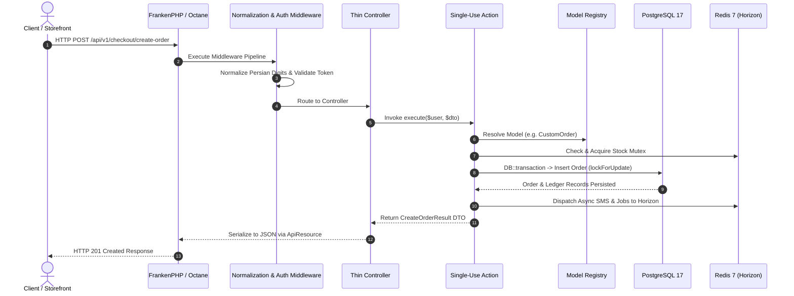

# Request Lifecycle

- [Introduction](#introduction)
- [Lifecycle Overview Diagram](#lifecycle-overview)
- [First Steps: Ingress & Octane Server](#ingress-octane)
- [HTTP Middleware & Normalization](#middleware-normalization)
- [Thin Controllers & Form Requests](#thin-controllers)
- [Domain Actions & Dynamic Model Resolution](#domain-actions)
- [Concurrency, Database Transactions & Ledger](#transactions-and-ledger)
- [Response Serialization](#response-serialization)

<a name="introduction"></a>
## Introduction

When using any tool in the "real world", you feel more confident if you understand how that tool works. Application development is no different. When you understand how a request flows through the **Reyhan Commerce** headless engine, everything feels more approachable and extensible.

As a 100% headless commerce framework, Reyhan's request lifecycle follows a decoupled, highly performant path optimized for **Laravel Octane (FrankenPHP)**, native database transactions, and sub-millisecond in-memory cache operations.

---

<a name="lifecycle-overview"></a>
## Lifecycle Overview Diagram



---

<a name="ingress-octane"></a>
## First Steps: Ingress & Octane Server

The entry point for all requests to a Reyhan Commerce application is the `public/index.php` file. All requests are directed to this file by your web server (Caddy, Nginx, or FrankenPHP).

Under **Laravel Octane**, application bootstrapping occurs in worker memory once upon server start. Subsequent HTTP requests execute directly against pre-warmed service providers and container bindings, resulting in microsecond response latencies.

---

<a name="middleware-normalization"></a>
## HTTP Middleware & Normalization

Every incoming request passes through global and route-specific middleware pipelines:

1. **CORS & Origin Validation:** Verifies stateful domain origins against `CORS_ALLOWED_ORIGINS` and `SANCTUM_STATEFUL_DOMAINS`.
2. **Text & Digit Normalization:** Automatically standardizes input characters:
   * Converts Persian and Arabic numerals (`۰-۹`, `٠-٩`) in mobile numbers, national IDs, and quantities into ASCII digits (`0-9`).
   * Unifies Arabic characters (`ي`, `ك`) to Persian (`ی`, `ک`).
   * Sanitizes Zero-Width Non-Joiners (ZWNJ).
3. **Authentication & Rate Limiting:** Evaluates customer Sanctum Bearer tokens and OTP attempt rate limits.

---

<a name="thin-controllers"></a>
## Thin Controllers & Form Requests

In adherence to clean architecture principles, controllers in Reyhan are strictly thin:
- Controllers **never** execute raw database queries.
- Controllers **never** contain inline business calculations or order placement logic.
- Incoming payloads are validated via Form Requests and cast into strongly-typed **Data Transfer Objects (DTOs)**:

```php
public function store(CreateOrderRequest $request, CreateOrderAction $action): JsonResponse
{
    $dto = CreateOrderData::from($request->validated());
    $result = $action->execute($request->user(), $dto);

    return OrderResource::make($result->order)
        ->response()
        ->setStatusCode(201);
}
```

---

<a name="domain-actions"></a>
## Domain Actions & Dynamic Model Resolution

Business logic is encapsulated entirely within `final` Action classes under `Reyhan\Core\Actions` (or `app/Actions` in your application). When an Action executes:

1. **Dynamic Model Resolution:** Resolves model classes through `Reyhan::model('product')`, guaranteeing that custom models, attributes, and relationships are respected automatically.
2. **Pipeline Execution:** Passes payloads through configured domain pipelines (such as `checkout` or `pricing`).

---

<a name="transactions-and-ledger"></a>
## Concurrency, Database Transactions & Ledger

Reyhan implements a battle-tested **Two-Tier Concurrency Architecture**:

1. **Tier 1 (Redis 7 Sorted Sets):** Acquires temporary atomic stock reservations during checkout.
2. **Tier 2 (PostgreSQL Pessimistic Locking):** Executes database mutations within `DB::transaction()` using `lockForUpdate()` to prevent double-spending or overselling.
3. **Double-Entry Ledger:** Posts balanced financial debit and credit transactions for wallets, invoices, and refunds.
4. **Queue Dispatch:** Pushes long-running operations (SMS alerts, invoice PDFs, webhooks) to background queues managed by **Laravel Horizon**.

---

<a name="response-serialization"></a>
## Response Serialization

The Action returns a typed result DTO back to the controller. The controller serializes the payload using Laravel API Resources (`OrderResource`, `ProductResource`, `CartResource`), producing a standard JSON response matching the OpenAPI specification at `/docs/api`.
