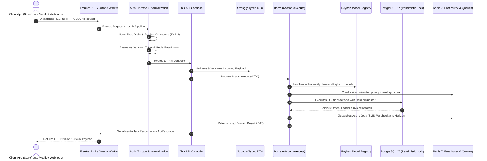

# Headless Request Lifecycle

Understanding how a request flows through the **Reyhan Commerce** backend engine is essential for extending the framework, implementing custom pipelines, and developing modular extensions. As a 100% headless commerce framework, the lifecycle follows a strictly decoupled, highly performant path optimized for **Laravel Octane (FrankenPHP)**, native database transactions, and sub-millisecond in-memory cache operations.

---

## 🏛️ The Complete Headless Request Flow



---

## 1. High-Performance Ingress (Laravel Octane & FrankenPHP)

When a client application (such as the official decoupled Nuxt storefront, a native Flutter/iOS app, or a 3rd-party webhook) sends an HTTP request:

1. **In-Memory Worker Processing:** The request is handled directly in memory by **Laravel Octane** running the **FrankenPHP** server engine, bypassing typical PHP-FPM process bootstrapping overhead.
2. **State Isolation:** Singleton dependencies and dynamic model registries are maintained safely across requests without memory leaks.
3. **CORS & Origin Handling:** The request origin is validated against configured stateful domains and allowed API origins.

---

## 2. Text & Digit Normalization Pipeline

Every incoming request to `/api/v1/*` passes through the **Reyhan Normalization Pipeline**:

```php
Reyhan\Core\Pipelines\Normalizer\NormalizeCharactersPipe::class
Reyhan\Core\Pipelines\Normalizer\NormalizeDigitsPipe::class
Reyhan\Core\Pipelines\Normalizer\NormalizeZwnjPipe::class
```

This automated layer ensures that:
* Arabic characters (`ي`, `ك`) are converted to standard Persian characters (`ی`, `ک`).
* Persian and Arabic numerals (`۰-۹`, `٠-٩`) in mobile phone numbers, national IDs, postal codes, and quantities are converted into ASCII integers (`0-9`).
* Zero-width non-joiners (ZWNJ, `\u200C`) and irregular whitespace are sanitized prior to database queries.

---

## 3. Thin Controllers & Strongly-Typed DTOs

In adherence to **Farshid's Laravel Constitution**, controllers in Reyhan are strictly thin:
- Controllers **never** execute raw database queries.
- Controllers **never** contain inline business calculations or order placement logic.
- Incoming payloads are validated via Form Requests and cast into strongly-typed **Data Transfer Objects (DTOs)**:

```php
public function store(CreateOrderRequest $request, CreateOrderAction $action): JsonResponse
{
    $dto = CreateOrderData::from($request->validated());
    $result = $action->execute($request->user(), $dto);

    return OrderResource::make($result->order)->response()->setStatusCode(201);
}
```

---

## 4. Single-Responsibility Actions & Atomic Boundaries

Business operations are encapsulated in `final` Action classes under `Reyhan\Core\Actions` (or `App\Actions` in userland). When an Action executes:

1. **Dynamic Model Resolution:** Resolves model classes through `Reyhan::model('product')`, guaranteeing that userland model customizations and extra columns are automatically respected.
2. **Two-Tier Concurrency Protection:**
   - **Tier 1:** Queries Redis 7 sorted sets for temporary atomic stock reservations.
   - **Tier 2:** Enters `DB::transaction()` and applies PostgreSQL pessimistic row locks (`lockForUpdate()`) to commit permanent stock decrements without race conditions.
3. **Double-Entry Ledger Balancing:** Monetary mutations (invoices, refunds, customer wallets) are audited and posted to the double-entry accounting ledger (`Reyhan::ledger()`).
4. **Asynchronous Job Dispatch:** Long-running operations (transactional SMS dispatch, webhooks, invoice generation) are pushed to Redis queues managed by **Laravel Horizon**.

---

## 5. API Resource Serialization

The Action returns a typed result object or model back to the controller, which serializes the payload using Laravel API Resources (`OrderResource`, `ProductResource`, `CartResource`). The serialized JSON response matches the OpenAPI specification rendered at `/docs/api`.
