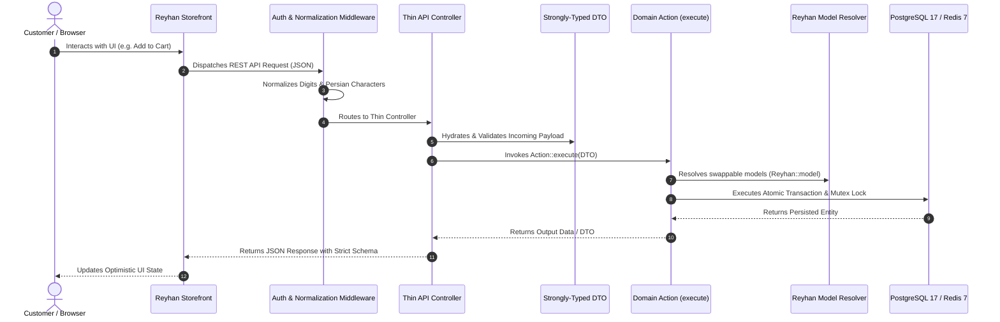

# Request Lifecycle

Understanding how a request flows through Reyhan Commerce is essential for extending the platform and creating custom extensions. The lifecycle follows a predictable, highly optimized path through specialized domain layers.

---

## The Complete Flow

---

## 1. Storefront Initiation & Hydration
When a customer loads a page:
1. The Storefront resolves initial server-side rendered (SSR) state.
2. The `app.config.ts` configuration injects brand tokens (colors, announcement bar, logo, contact metadata).
3. The `useCartStore` reads local storage/cookies and verifies the active cart token with the backend.

---

## 2. Text & Input Normalization Middleware
Every incoming API request passes through the **Reyhan Normalization Pipeline**. This automated layer:
* Converts Arabic characters (`ي`, `ك`) to standardized Persian equivalents (`ی`, `ک`).
* Normalizes Persian/Arabic digits (`۱۲۳۴۵۶`) to standard numeric integers.
* Cleans zero-width non-joiners (ZWNJ) and trims erratic whitespace before database queries are formulated.

---

## 3. DTO Hydration & Validation
Controllers in Reyhan are strictly "thin." They do not perform raw database queries or complex branching logic. Incoming data is immediately cast into a dedicated **Data Transfer Object (DTO)** using typed properties and validation rules.

---

## 4. Action Execution & Database Transactions
The controller passes the validated DTO to a single `final` Action class (e.g., `CreateOrderAction`). The action executes inside a database transaction:
* Resolves active models via `Reyhan::model('...')`.
* Acquires necessary concurrency locks (e.g. atomic inventory reservations).
* Dispatches background notifications (SMS, webhooks) via Redis queues.
* Emits domain events.
