# Multi-Auth & Guard Boundaries

- [Introduction](#introduction)
- [Actor Separation Architecture](#actor-separation)
- [Customer Authentication: Passwordless Mobile OTP](#customer-authentication)
    - [The OTP Flow](#the-otp-flow)
    - [Sanctum Token Issuance](#sanctum-token-issuance)
- [Staff Authentication: Isolated Admin Guard](#staff-authentication)
- [Role-Based Access Control (RBAC) & Audit Trails](#rbac-and-audit)

<a name="introduction"></a>
## Introduction

Authentication and authorization in Reyhan Commerce are founded upon the **Principle of Complete Actor Segregation**. Store staff and retail customers represent two entirely different trust levels, threat profiles, and lifecycle interactions.

Customers access the headless store via mobile phone number OTP verification and revocable **Laravel Sanctum** tokens. Administrative staff, meanwhile, authenticate against dedicated credentials in an isolated `admins` table with fine-grained **Filament Shield** permissions.

---

<a name="actor-separation"></a>
## Actor Separation Architecture

```mermaid
graph TD
    subgraph OperationsRealm ["Operations & Staff Realm"]
        Staff["Admin / Store Operator"] -->|"Session Auth & Filament v5"| AdminPanel["Backoffice Console"]
        AdminPanel --> AdminGuard["Guard: admin"]
        AdminGuard --> AdminModel["Model: Reyhan\Core\Models\Admin"]
        AdminModel --> Shield["Filament Shield RBAC"]
    end

    subgraph CustomerRealm ["Customer Shopping Realm"]
        Customer["Retail Customer"] -->|"Mobile Number + OTP"| Storefront["Nuxt Storefront / Mobile App"]
        Storefront -->|"Sanctum Bearer Token"| SanctumGuard["Guard: sanctum"]
        SanctumGuard --> UserModel["Model: Reyhan\Core\Models\User"]
        UserModel --> ShoppingEntities["Orders, Cart, Addresses, Wallet"]
    end
```



---

<a name="customer-authentication"></a>
## Customer Authentication: Passwordless Mobile OTP

In modern Iranian e-commerce, forcing customers to remember passwords creates high checkout friction. Reyhan implements a fast, passwordless mobile OTP authentication pipeline out of the box.

<a name="the-otp-flow"></a>
### The OTP Flow

1. **OTP Request:** The client sends a request to `POST /api/v1/auth/otp/request` with the customer's Iranian mobile number (`09...` or `+989...`).
2. **Rate Limiting & Generation:** The server normalizes the mobile number, verifies that a 120-second cooldown has passed in Redis, generates a cryptographically secure 5-digit token, and stores it with a 2-minute TTL.
3. **Transactional SMS Dispatch:** An asynchronous SMS job is dispatched through the configured fast-service pattern provider (Kavenegar, FarazSMS, etc.).
4. **Verification & Login:** The client posts the received token to `POST /api/v1/auth/otp/verify`.

<a name="sanctum-token-issuance"></a>
### Sanctum Token Issuance

Upon successful OTP verification, the `VerifyOtpAction` retrieves or creates the user and issues a standard Sanctum Bearer token:

```json
{
  "token": "1|qX9...token_string",
  "token_type": "Bearer",
  "user": {
    "id": 1,
    "mobile": "09123456789",
    "full_name": "علی رضایی",
    "is_identity_verified": false
  }
}
```

---

<a name="staff-authentication"></a>
## Staff Authentication: Isolated Admin Guard

Administrative staff exist in an isolated `admins` database table and authenticate via the `admin` guard:

* **Session Security:** Admin sessions are encrypted and managed independently of customer tokens.
* **Brute-force Lockdown:** Staff login attempts are rate-limited via Laravel's rate limiters.
* **Multi-Factor Authentication (MFA):** Supports TOTP two-factor authentication for backoffice staff.

---

<a name="rbac-and-audit"></a>
## Role-Based Access Control (RBAC) & Audit Trails

Through **Filament Shield**, administrators can define granular roles:

* **Super Admin:** Unrestricted access to system configuration, payments, and staff accounts.
* **Warehouse Operator:** Scoped access to inventory management, barcode scanning, and order packing.
* **Accountant:** Read-only access to financial ledger transactions, sales reports, and invoice exports.

Every state mutation in the backoffice is automatically recorded in the activity log with Jalali timestamps and the acting admin's identity.
