# Multi-Auth & Guard Boundaries

Security and authentication in Reyhan Commerce are founded upon the **Principle of Complete Actor Segregation**. Store staff and retail customers represent two entirely different trust levels, threat profiles, and authentication mechanisms.

---

## 1. Actor Separation Architecture

```mermaid
graph TD
    subgraph OperationsRealm [Operations & Staff Realm]
        Staff[Admin / Operator] -->|Session Auth + fa/RTL Panel| AdminPanel[Filament 5 Admin Panel]
        AdminPanel --> AdminGuard[Guard: admin]
        AdminGuard --> AdminModel[Model: Reyhan\Core\Models\Admin]
        AdminModel --> Shield[Spatie Permissions & Role Shield]
    end

    subgraph CustomerRealm [Customer Shopping Realm]
        Customer[Shopping Customer] -->|Passwordless Mobile OTP| Storefront[Nuxt 4 Storefront]
        Storefront --> SanctumGuard[Guard: sanctum]
        SanctumGuard --> UserModel[Model: Reyhan\Core\Models\User / App\Models\User]
        UserModel --> ShoppingEntities[Orders, Addresses, Wishlists, Cart]
    end
```

---

## 2. Customer Authentication: Passwordless Mobile OTP

Retail customers do not manage passwords. In modern e-commerce, forcing users to remember or reset complex passwords causes high checkout friction and cart abandonment.

### Customer Workflow
1. The customer enters their verified mobile phone number.
2. The **SmsManager** dispatches a cryptographically secure 5-digit PIN via a transactional SMS pattern.
3. The customer submits the PIN via the storefront's `<UPinInput>` component.
4. The backend verifies the token and returns a revocable **Sanctum Bearer Token** for API session authorization.

---

## 3. Administrative Authentication: Guard-Isolated Staff

Administrative users exist in an isolated table (`admins`) and authenticate strictly via the `admin` guard:
* **Role-Based Access Control (RBAC):** Powered by native permission policies and Filament Shield.
* **Separation of Concerns:** Even if a customer table is compromised, administrative session tokens and credentials remain completely isolated.
* **Audit Logging:** Every administrative mutation, status change, and refund is attributed directly to the authenticated `Admin` entity with Jalali timestamping.
