# Multi-Auth & Guard Boundaries

Security and authentication in Reyhan Commerce are founded upon the **Principle of Complete Actor Segregation**. Store staff and retail customers represent two entirely different trust levels, threat profiles, and authentication mechanisms.

---

## 1. Actor Separation Architecture

```mermaid
graph TD
    subgraph OperationsRealm ["Operations & Staff Realm"]
        Staff["Admin / Operator"] -->|"Session Auth + fa/RTL Panel"| AdminPanel["Filament 5 Admin Panel"]
        AdminPanel --> AdminGuard["Guard: admin"]
        AdminGuard --> AdminModel["Model: Reyhan\Core\Models\Admin"]
        AdminModel --> Shield["Spatie Permissions & Role Shield"]
    end

    subgraph CustomerRealm ["Customer Shopping Realm"]
        Customer["Shopping Customer"] -->|"RESTful OTP API"| ClientApp["Client App / Storefront / Mobile"]
        ClientApp -->|"Bearer Token"| SanctumGuard["Guard: sanctum"]
        SanctumGuard --> UserModel["Model: Reyhan\Core\Models\User / App\Models\User"]
        UserModel --> ShoppingEntities["Orders, Addresses, Wishlists, Cart"]
    end
```

---

## 2. Customer Authentication: Passwordless Mobile OTP

Retail customers do not manage passwords. In modern e-commerce, forcing users to remember or reset complex passwords causes high checkout friction and cart abandonment.

### Customer Authentication Flow

1. **OTP Request:** The client application sends a request to `POST /api/v1/auth/otp/request` containing the customer's mobile phone number and a solved cryptographic captcha token.
2. **Dispatch & Rate Limiting:** The backend checks Redis DB 0 rate limits (maximum 1 request per 120 seconds per mobile), generates a secure 5-digit verification token with a 120-second TTL, and queues a `SendOtpSmsJob` via `SmsManager`.
3. **Verification:** The client submits the code to `POST /api/v1/auth/otp/verify`.
4. **Sanctum Token Issuance:** The backend verifies the token, finds or creates the customer entity in the database, and returns a revocable **Sanctum Bearer Token** for authenticated API sessions.

---

## 3. Administrative Authentication: Guard-Isolated Staff

Administrative users exist in an isolated database table (`admins`) and authenticate strictly via the `admin` guard:
* **Role-Based Access Control (RBAC):** Powered by native permission policies and **Filament Shield**.
* **Complete Token Isolation:** Customer authentication tables and tokens are entirely separate from administrative staff credentials.
* **Audit Logging:** Every administrative mutation, status change, price adjustment, and refund is attributed directly to the authenticated `Admin` entity with Jalali timestamping.
