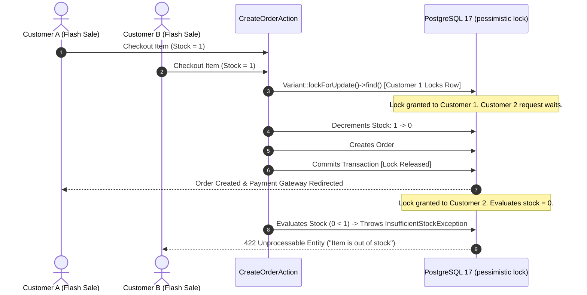

# Cart, Checkout & Concurrency Locks

In high-volume e-commerce, flash sales and campaign traffic can trigger severe **Race Conditions**—leading to overselling inventory beyond physical warehouse limits. Reyhan Commerce employs robust **Atomic Mutexes and Pessimistic Locking** during checkout.

---

## 1. Concurrency Protection Workflow



---

## 2. Guest-to-Authenticated Cart Synchronization

Reyhan supports seamless guest shopping with immediate cart migration upon authentication:

1. **Guest Phase:** Unauthenticated shoppers store items locally in browser storage and Redis session keys.
2. **Authentication Phase:** When the customer logs in via SMS OTP, the storefront issues a single synchronization call:
   ```http
   POST /api/v1/cart/sync
   Content-Type: application/json
   Authorization: Bearer <sanctum_token>

   {
     "items": [
       { "variant_id": 42, "quantity": 2 }
     ]
   }
   ```
3. **Merge Engine:** The backend atomically aggregates quantities, checks current stock availability, applies user-specific tier pricing, and returns the unified active cart payload.

---

## 3. Order Status State Machine

Orders progress through a strictly defined lifecycle powered by native PHP 8.3+ Backed Enums:

```php
namespace Reyhan\Core\Enums\Order;

enum OrderStatus: string
{
    case PendingPayment = 'pending_payment';
    case Processing     = 'processing';
    case Shipped        = 'shipped';
    case Delivered      = 'delivered';
    case Cancelled      = 'cancelled';
    case Refunded       = 'refunded';
}
```
