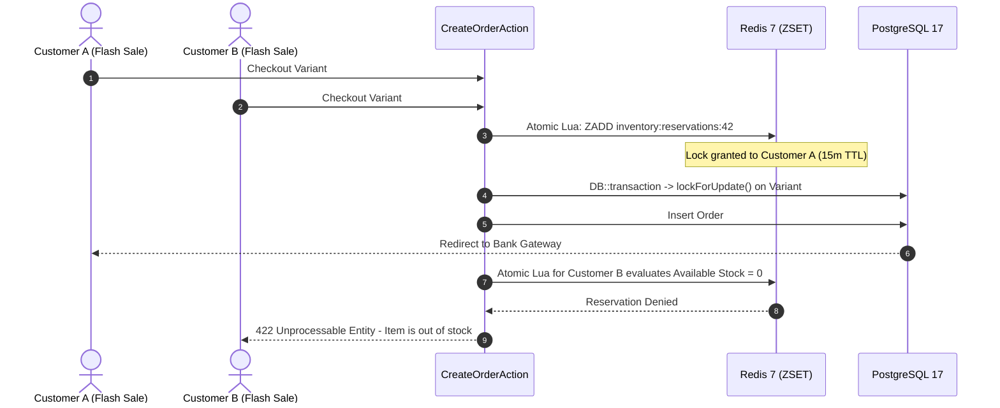

# Cart, Checkout & Concurrency Locks

- [Introduction](#introduction)
- [The Two-Tier Concurrency Architecture](#concurrency-architecture)
    - [Tier 1: Redis Sorted Set Stock Reservations](#tier-1-redis)
    - [Tier 2: PostgreSQL Pessimistic Row Locking](#tier-2-postgres)
- [Shopping Cart Management](#cart-management)
    - [Guest to Authenticated Synchronization](#guest-sync)
- [The Order Lifecycle & State Machine](#order-state-machine)
- [Testing Concurrency & Stock Locks](#testing-concurrency)

<a name="introduction"></a>
## Introduction

During high-volume traffic events (such as flash sales, Black Friday, or product drops), thousands of concurrent shoppers may attempt to purchase the same inventory item simultaneously. Without strict concurrency guards, standard database queries result in **Race Conditions** and overselling inventory beyond physical warehouse stock.

Reyhan Commerce implements an enterprise **Two-Tier Concurrency & Locking Architecture** that guarantees zero inventory overselling while maintaining sub-millisecond response times.

---

<a name="concurrency-architecture"></a>
## The Two-Tier Concurrency Architecture



<a name="tier-1-redis"></a>
### Tier 1: Redis Sorted Set Stock Reservations

When a customer proceeds to checkout, Reyhan executes an atomic Lua script that creates a temporary reservation in a Redis Sorted Set (`ZSET`).

* **Member:** `reservationId:quantity`
* **Score:** Expiration timestamp (Unix timestamp + 15 minutes)
* **Self-Purging:** Expired reservation entries are automatically purged during every reservation check without leaving ghost locks.

<a name="tier-2-postgres"></a>
### Tier 2: PostgreSQL Pessimistic Row Locking

When the payment gateway returns a verified payment callback, the `VerifyPaymentAction` enters a database transaction and applies a pessimistic row lock:

```php
DB::transaction(function () use ($order) {
    foreach ($order->items as $item) {
        /** @var \Reyhan\Core\Models\ProductVariant $variant */
        $variant = ProductVariant::query()
            ->lockForUpdate()
            ->findOrFail($item->variant_id);

        if ($variant->stock < $item->quantity) {
            throw new InsufficientStockException('Physical stock deficit detected.');
        }

        $variant->decrement('stock', $item->quantity);
    }

    $order->markAsProcessing();
});
```

---

<a name="cart-management"></a>
## Shopping Cart Management

<a name="guest-sync"></a>
### Guest to Authenticated Synchronization

Reyhan supports seamless guest browsing. When a guest customer authenticates via OTP SMS, the client application issues a synchronization request to merge guest session items into the authenticated account:

```http
POST /api/v1/cart/sync
Content-Type: application/json
Authorization: Bearer <sanctum_token>

{
  "items": [
    { "variant_id": 42, "quantity": 2 }
  ]
}
```

Reyhan merges item quantities, verifies current stock availability, re-evaluates promotional discounts, and returns the updated cart.

---

<a name="order-state-machine"></a>
## The Order Lifecycle & State Machine

Orders transition through a strictly guarded lifecycle powered by PHP 8.4 Backed Enums:

```php
namespace Reyhan\Core\Enums\Order;

enum OrderStatus: string
{
    case PendingPayment = 'pending_payment';
    case Processing     = 'processing';
    case Shipped        = 'shipped';
    case Delivered      = 'delivered';
    case Cancelled      = 'cancelled';
    case Refunded       = 'refunded';
}
```

| Transition | Allowed From | Triggered By |
| :--- | :--- | :--- |
| `Processing` | `PendingPayment` | Bank payment verification webhook or admin manual approval |
| `Shipped` | `Processing` | Warehouse barcode scan and shipping label dispatch |
| `Delivered` | `Shipped` | Carrier API delivery confirmation or customer confirmation |
| `Cancelled` | `PendingPayment`, `Processing` | Payment timeout (15m) or customer cancellation |
| `Refunded` | `Processing`, `Delivered` | Staff refund via Ledger service |

---

<a name="testing-concurrency"></a>
## Testing Concurrency & Stock Locks

You can assert concurrency protection in **Pest 4**:

```php
<?php

declare(strict_types=1);

use Reyhan\Core\Exceptions\InsufficientStockException;
use Reyhan\Core\Facades\Inventory;
use Reyhan\Core\Models\ProductVariant;

it('prevents overselling when stock is depleted', function () {
    $variant = ProductVariant::factory()->create(['stock' => 1]);

    // Reserve only available item
    $firstReserve = Inventory::reserve($variant->id, 1, 'order-1', 900);
    expect($firstReserve)->toBeTrue();

    // Second customer attempts to reserve
    $secondReserve = Inventory::reserve($variant->id, 1, 'order-2', 900);
    expect($secondReserve)->toBeFalse();
});
```
