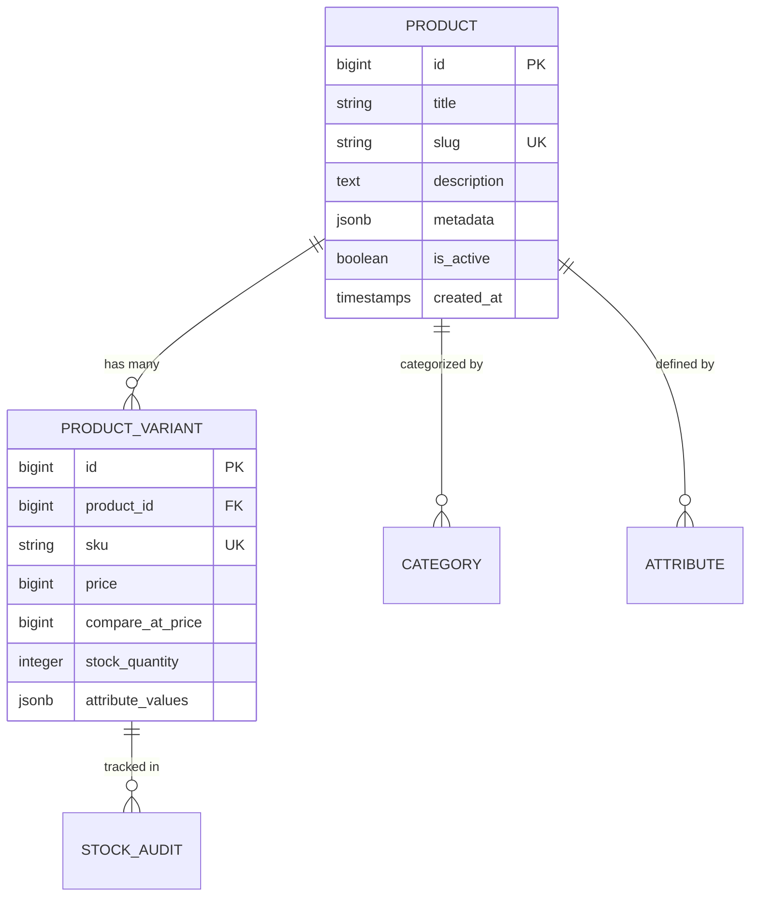

# Catalog, Products & Variants

The catalog engine in **Reyhan Commerce** provides a high-performance relational structure capable of managing simple goods, multi-attribute configurable products (e.g., color, size, volume), dynamic pricing matrices, and localized media galleries.

---

## 1. Relational Schema Architecture



---

## 2. Dynamic Attribute Matrix (JSONB)

Instead of relying on rigid, slow EAV (Entity-Attribute-Value) anti-patterns with dozen-table joins, Reyhan leverages PostgreSQL's native `JSONB` with `GIN` indices for product variant attributes:

```json
{
  "attributes": {
    "color": {
      "label": "Ruby Red",
      "hex": "#E11D48"
    },
    "volume": {
      "label": "50ml",
      "unit": "ml"
    }
  }
}
```

This ensures:
1. **Zero Schema Migrations for New Attributes:** Store owners can define arbitrary new attributes (e.g., Shade, Finish, Fabric, Size) directly from the admin panel.
2. **Sub-millisecond Filtering:** Indexed querying directly inside PostgreSQL:
   ```sql
   SELECT * FROM product_variants 
   WHERE attribute_values->'color'->>'hex' = '#E11D48';
   ```

---

## 3. SEO-Optimized Slugging

Reyhan includes automated, Persian-compatible unique slug generation:
* Converts spaces and special punctuation cleanly.
* Handles duplicate titles automatically by appending unique numerical sequences.
* Integrates with `@nuxtjs/seo` and `Schema.org` Product structured data out of the box.
