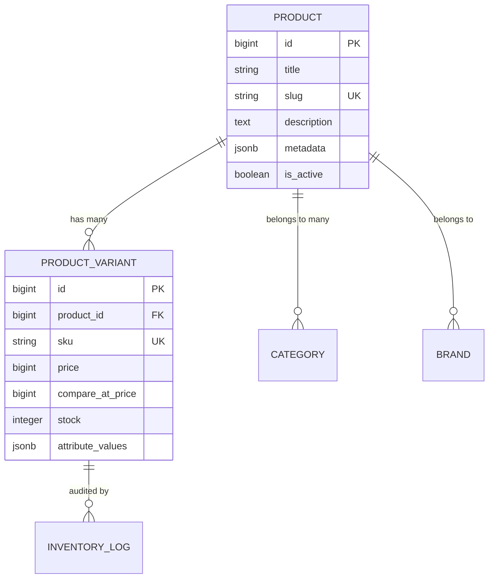

# Catalog, Products & Variants

- [Introduction](#introduction)
- [Relational Schema Architecture](#schema-architecture)
- [Dynamic Variant Matrices (PostgreSQL JSONB)](#dynamic-matrices)
- [Managing Products & Variants via Eloquent](#eloquent-usage)
- [Category Trees & Hierarchies](#category-trees)
- [Persian Slugging & SEO Metadata](#slugging-and-seo)

<a name="introduction"></a>
## Introduction

The catalog engine in **Reyhan Commerce** provides a high-performance relational structure capable of handling simple goods, multi-attribute configurable products (e.g., color, size, volume), dynamic pricing matrices, and localized media galleries.

Instead of adopting slow EAV (Entity-Attribute-Value) anti-patterns with dozen-table SQL joins, Reyhan leverages **PostgreSQL 17 JSONB** with **GIN indexing** for blazing-fast attribute filtering and variant lookup.

---

<a name="schema-architecture"></a>
## Relational Schema Architecture



---

<a name="dynamic-matrices"></a>
## Dynamic Variant Matrices (PostgreSQL JSONB)

Product variants store their specific attributes in an indexed `attribute_values` JSONB column:

```json
{
  "color": {
    "name": "قرمز یاقوتی",
    "hex": "#E11D48"
  },
  "volume": {
    "name": "۵۰ میلی‌لیتر",
    "unit": "ml",
    "value": 50
  }
}
```

### Key Advantages

1. **Zero Database Migrations for New Attributes:** Store owners can dynamically define new attributes (e.g., Shade, Finish, Fabric, Size) from the Filament admin panel without altering database tables.
2. **Sub-Millisecond Querying:** GIN-indexed querying enables instant faceted search in PostgreSQL:
   ```sql
   SELECT * FROM product_variants 
   WHERE attribute_values->'color'->>'hex' = '#E11D48';
   ```

---

<a name="eloquent-usage"></a>
## Managing Products & Variants via Eloquent

You can query products and eager-load variants fluently:

```php
use Reyhan\Core\Models\Product;

// Query active products with available variants
$products = Product::query()
    ->where('is_active', true)
    ->with(['variants' => fn ($q) => $q->where('stock', '>', 0)])
    ->paginate(24);
```

### Accessing Variant Attributes

```php
$variant = $product->variants->first();

// Access strongly typed attribute values
$colorName = $variant->attribute_values['color']['name'] ?? null;
```

---

<a name="category-trees"></a>
## Category Trees & Hierarchies

Reyhan features nested tree categories powered by `alareqi/filament-tree`:

```php
use Reyhan\Core\Models\Category;

// Retrieve root categories with descendants
$categoryTree = Category::query()
    ->whereNull('parent_id')
    ->with('children.children')
    ->get();
```

---

<a name="slugging-and-seo"></a>
## Persian Slugging & SEO Metadata

Reyhan includes automated Persian-compatible unique slug generation and OpenGraph metadata generation:

* Automatically cleans irregular Persian characters and whitespace.
* Generates SEO Schema.org `Product` structured data JSON-LD out of the box for search engine indexing.
