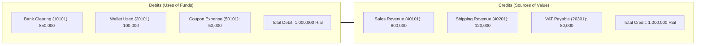

# Double-Entry Financial Ledger Engine

To guarantee zero financial discrepancies, fraud resistance, and full auditability, **Reyhan Commerce** includes a built-in **Double-Entry General Ledger Subsystem**.

Every commercial transaction (order settlement, wallet top-up, voucher grant, customer refund) creates an atomic `LedgerTransaction` containing strictly balanced `LedgerEntry` records (`sum(debit) === sum(credit)`).

---

## 1. Accounting Chart of Accounts

Reyhan seeds standard enterprise ledger accounts during framework installation:

| Account Code | Account Name | Type | Normal Balance | Description |
| :--- | :--- | :--- | :--- | :--- |
| `10101` | Online Gateway Clearing (Shaparak) | Asset | Debit | Funds received via online banking gateways (Zarinpal, SEP, Behpardakht) |
| `10102` | Card-to-Card In-Transit | Asset | Debit | Offline card-to-card settlements awaiting staff approval |
| `20101` | Customer Wallet Liabilities | Liability | Credit | Customer deposited store credit and gift wallet balances |
| `20301` | Value-Added Tax (VAT) Payable | Liability | Credit | Official Iranian 10% sales tax collected on behalf of the tax authority |
| `40101` | Gross Merchandise Revenue | Revenue | Credit | Gross merchandise value sold across catalog items |
| `40201` | Shipping & Logistics Revenue | Revenue | Credit | Shipping fees paid by customers |
| `50101` | Promotional Discount Expense | Expense | Debit | Marketing vouchers and coupon deductions absorbed by the store |

---

## 2. Order Settlement Balance Equation

Upon successful payment verification, `CreateLedgerJournalEntryAction` validates the following invariant:

$$\text{Debit} (\text{Bank} + \text{Wallet} + \text{Discounts}) = \text{Credit} (\text{Merchandise} + \text{Shipping} + \text{VAT})$$



If an unbalanced transaction is attempted, the database transaction rolls back immediately and throws an `InvalidArgumentException`.

---

## 3. The `Ledger` Facade

Developers and extensions interact with the accounting engine via the fluent `Ledger` facade:

```php
use Reyhan\Core\Facades\Ledger;

// Record a balanced journal entry for an order payment
$transaction = Ledger::recordOrderSettlement($order, $payment);

// Query net balance for any ledger account
$gatewayCash = Ledger::getAccountBalance('10101'); // Net Bank Clearing
$walletLiability = Ledger::getAccountBalance('20101'); // Total customer deposits held
$taxCollected = Ledger::getAccountBalance('20301'); // Total VAT due
```
