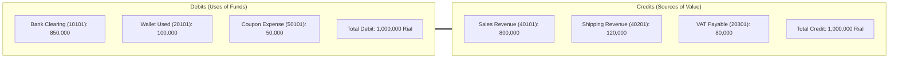

# Double-Entry Financial Ledger

- [Introduction](#introduction)
- [Chart of Accounts](#chart-of-accounts)
- [The Balanced Invariant Equation](#balanced-equation)
- [Recording Ledger Transactions](#recording-transactions)
- [Customer Wallet Balances & Refunds](#wallets-and-refunds)
- [Testing Ledger Integrity](#testing-ledger)

<a name="introduction"></a>
## Introduction

To guarantee absolute financial integrity, eliminate discrepancies, and prevent silent double-spending, **Reyhan Commerce** includes a built-in **Double-Entry General Ledger Engine**.

Unlike naive shopping carts that simply store a `balance` integer on the user record, every monetary mutation in Reyhan (order settlement, wallet top-up, coupon expense, or staff refund) creates an atomic `LedgerTransaction` containing strictly balanced `LedgerEntry` records (`sum(debits) === sum(credits)`).

---

<a name="chart-of-accounts"></a>
## Chart of Accounts

Reyhan seeds standard enterprise ledger accounts during framework initialization:

| Account Code | Account Name | Type | Normal Balance | Description |
| :--- | :--- | :--- | :--- | :--- |
| `10101` | Online Gateway Clearing (Shaparak) | Asset | Debit | Funds received via online banking gateways (Zarinpal, SEP, Mellat) |
| `10102` | Card-to-Card In-Transit | Asset | Debit | Offline card-to-card settlements awaiting staff approval |
| `20101` | Customer Wallet Liabilities | Liability | Credit | Customer-deposited store credit and gift wallet balances |
| `20301` | Value-Added Tax (VAT) Payable | Liability | Credit | Official Iranian 10% sales tax collected for tax authorities |
| `40101` | Gross Merchandise Revenue | Revenue | Credit | Gross value sold across catalog products |
| `40201` | Shipping & Logistics Revenue | Revenue | Credit | Shipping freight paid by customers |
| `50101` | Promotional Discount Expense | Expense | Debit | Marketing vouchers and coupon deductions absorbed by the store |

---

<a name="balanced-equation"></a>
## The Balanced Invariant Equation

Upon payment verification, the `RecordLedgerTransactionAction` validates the fundamental accounting equation:

$$\text{Debit} (\text{Bank} + \text{Wallet} + \text{Discounts}) = \text{Credit} (\text{Merchandise} + \text{Shipping} + \text{VAT})$$



> [!WARNING]  
> If an unbalanced transaction is attempted, the database transaction rolls back immediately and throws an `UnbalancedLedgerTransactionException`.

---

<a name="recording-transactions"></a>
## Recording Ledger Transactions

You can record journal entries via the `Ledger` facade:

```php
use Reyhan\Core\Facades\Ledger;

// Record a balanced settlement transaction
$transaction = Ledger::recordTransaction(
    referenceType: 'order',
    referenceId: $order->id,
    debitAccount: '10101', // Bank clearing
    creditAccount: '40101', // Merchandise revenue
    amount: $order->final_payable,
    description: 'تسویه سفارش '.$order->tracking_code
);
```

---

<a name="wallets-and-refunds"></a>
## Customer Wallet Balances & Refunds

Customer wallet balances are derived dynamically by aggregating all credit vs. debit entries in account `20101` for that specific user:

```php
// Retrieve current available wallet credit
$walletBalance = Ledger::getCustomerWalletBalance($user);
```

When issuing a refund, Reyhan posts a reverse debit/credit journal entry without mutating previous historical transactions.

---

<a name="testing-ledger"></a>
## Testing Ledger Integrity

```php
<?php

declare(strict_types=1);

use Reyhan\Core\Exceptions\UnbalancedLedgerTransactionException;
use Reyhan\Core\Facades\Ledger;

it('rejects unbalanced ledger entries', function () {
    Ledger::recordManualEntry([
        ['account_code' => '10101', 'debit' => 1_000_000, 'credit' => 0],
        ['account_code' => '40101', 'debit' => 0, 'credit' => 900_000], // 100,000 gap
    ]);
})->throws(UnbalancedLedgerTransactionException::class);
```
