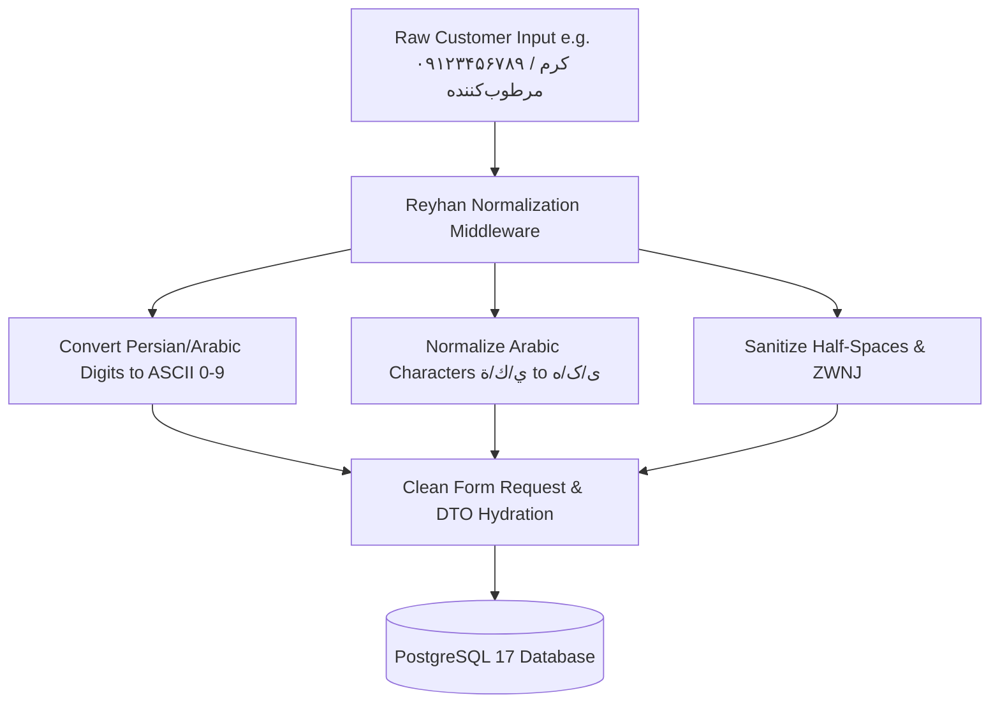

# Text & Digit Normalization

- [Introduction](#introduction)
- [How Normalization Works](#how-it-works)
- [Automatic Request Normalization](#middleware-pipeline)
- [Programmatic Usage](#programmatic-usage)
- [PostgreSQL Trigram & Fuzzy Search Integration](#trigram-search)
- [Testing Normalization](#testing-normalization)

<a name="introduction"></a>
## Introduction

In Iranian and regional e-commerce, inconsistencies in user keyboard layouts (such as mixed Arabic/Persian keyboards, Persian/Arabic numerals, and irregular zero-width non-joiners) frequently break phone number validations, National ID algorithms, and search query lookups.

Reyhan Commerce includes a dedicated, zero-dependency **Text Normalization Engine** that automatically cleans and standardizes incoming requests before they reach validation rules, Form Requests, or database queries.

---

<a name="how-it-works"></a>
## How Normalization Works



---

<a name="middleware-pipeline"></a>
## Automatic Request Normalization

Every HTTP request to the `/api/v1/*` routes automatically executes through the normalization middleware stack:

1. **Digit Conversion:** Translates all Persian (`۰-۹`) and Arabic (`٠-٩`) numerals into standard ASCII digits (`0-9`).
2. **Character Standardization:** Unifies Arabic `ي` and `ك` into Persian `ی` and `ک`, and maps Arabic `ة` to `ه`.
3. **ZWNJ Sanitization:** Strips redundant Zero-Width Non-Joiners and collapses irregular unicode spaces.

---

<a name="programmatic-usage"></a>
## Programmatic Usage

You can invoke the normalization utilities anywhere in your application:

```php
use Reyhan\Core\Services\Normalization\PersianNormalizer;

// 1. Convert numerals
$mobile = PersianNormalizer::toAsciiDigits('۰۹۱۲۳۴۵۶۷۸۹');
// Result: '09123456789'

// 2. Clean Persian typography
$title = PersianNormalizer::clean('كرم مرطوب‌كننده پوست');
// Result: 'کرم مرطوب‌کننده پوست'
```

---

<a name="trigram-search"></a>
## PostgreSQL Trigram & Fuzzy Search Integration

Normalized search strings are matched against PostgreSQL 17 using the `pg_trgm` extension and GIN indexing:

```sql
SELECT id, title, similarity(title, 'ضد آفتاب') AS score
FROM products
WHERE title % 'ضد آفتاب'
ORDER BY score DESC
LIMIT 20;
```

---

<a name="testing-normalization"></a>
## Testing Normalization

```php
<?php

declare(strict_types=1);

use Reyhan\Core\Services\Normalization\PersianNormalizer;

it('converts mixed arabic and persian numerals to ascii digits', function () {
    expect(PersianNormalizer::toAsciiDigits('۰۹۱۲۳۴۵۶۷۸۹'))->toBe('09123456789')
        ->and(PersianNormalizer::toAsciiDigits('٠١٢٣٤٥٦٧٨٩'))->toBe('0123456789');
});

it('unifies arabic letters to standard persian', function () {
    expect(PersianNormalizer::clean('كتاب كودك'))->toBe('کتاب کودک');
});
```
