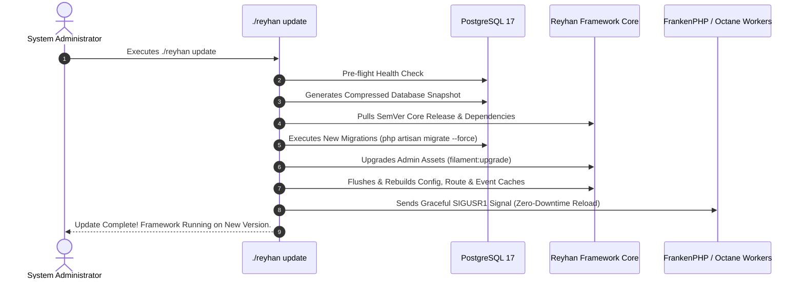

# Zero-Downtime Safe Updates

Upgrading e-commerce software is historically stressful. Reyhan Commerce eliminates update anxiety through an automated, atomic update pipeline triggered via `./reyhan update`.

---

## 1. The Update Pipeline Sequence



---

## 2. Automatic Pre-Update Backups

Before any database schema change is executed, the update orchestrator invokes `spatie/laravel-backup` to generate an encrypted snapshot of the current PostgreSQL database. If any migration fails, the update process safely terminates with zero data loss.

---

## 3. Running an Update

```bash
./reyhan update
```
