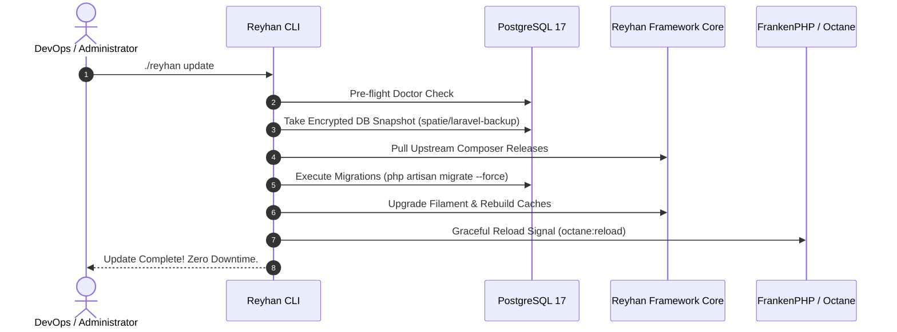

# Zero-Downtime Safe Updates

- [Introduction](#introduction)
- [The Update Sequence](#update-sequence)
- [Automated Database Backups](#automated-backups)
- [Executing an Update](#executing-update)
- [Update Safeguards Configuration](#configuration-safeguards)

<a name="introduction"></a>
## Introduction

Upgrading e-commerce software is historically stressful for engineering teams. Breaking database changes, stale asset caches, and dependency conflicts often result in unexpected downtime.

Reyhan Commerce permanently eliminates update anxiety through an automated, atomic update pipeline triggered via `./reyhan update`.

---

<a name="update-sequence"></a>
## The Update Sequence



---

<a name="automated-backups"></a>
## Automated Database Backups

Before executing any database migration, Reyhan automatically takes a compressed snapshot of your PostgreSQL database using `spatie/laravel-backup`. If any schema migration fails, the update process safely halts with zero data loss.

---

<a name="executing-update"></a>
## Executing an Update

To update your store:

```bash
./reyhan update
```

The command performs the following sequence automatically:
1. Runs `./reyhan doctor` to verify environment stability.
2. Backs up the database.
3. Updates `reyhan-commerce/core` via Composer.
4. Executes new database migrations.
5. Upgrades administrative assets (`php artisan filament:upgrade`).
6. Clears stale application, route, and Redis caches.
7. Gracefully reloads worker processes.

---

<a name="configuration-safeguards"></a>
## Update Safeguards Configuration

You can customize the behavior of the update command in `config/reyhan.php`:

```php
// config/reyhan.php

'updates' => [
    'backup_database_before_update' => env('REYHAN_BACKUP_ON_UPDATE', true),
    'run_migrations' => true,
    'upgrade_filament_assets' => true,
    'optimize_caches' => true,
    'reload_octane' => true,
],
```
