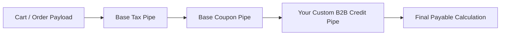

# Business Pipelines

- [Introduction](#introduction)
- [How Commercial Pipelines Work](#how-commercial-pipelines-work)
- [Available Pipeline Channels](#available-pipeline-channels)
- [Creating a Custom Pipe](#creating-a-custom-pipe)
- [Registering Custom Pipes](#registering-custom-pipes)
- [Practical Example: B2B Corporate Credit Check](#practical-example-b2b-credit)
- [Practical Example: Dynamic VIP Tiered Pricing](#practical-example-vip-pricing)
- [Halting and Short-Circuiting Pipelines](#halting-pipelines)
- [Testing Your Custom Pipelines](#testing-pipelines)

<a name="introduction"></a>
## Introduction

Complex commercial workflows—such as calculating final line-item prices, applying dynamic discount promotions, validating customer credit, or preparing orders for fulfillment—rarely follow a static, rigid sequence across different businesses.

To accommodate specialized business rules without modifying core engine logic, Reyhan Commerce implements the **Pipeline Pattern** (powered by Laravel's `Illuminate\Pipeline\Pipeline`). 

Pipelines allow you to pass a data transfer object (DTO) through a sequential stack of invokable classes ("pipes"). Each pipe inspects, mutates, or verifies the payload before passing it to the next stage in the chain.

---

<a name="how-commercial-pipelines-work"></a>
## How Commercial Pipelines Work

When an Action initiates a commercial operation (like `CheckoutAction` or `CalculatePricingAction`), it passes the domain payload through a pipeline configured in `config/reyhan.php`:



Each pipe receives the payload and a `$next` closure:

```php
namespace App\Pipelines\Checkout;

use Closure;
use Reyhan\Core\DTOs\CheckoutPayload;

final class VerifyCustomerCreditLimit
{
    public function handle(CheckoutPayload $payload, Closure $next): mixed
    {
        // 1. Perform custom inspection or mutation
        if ($payload->user->is_corporate && $payload->totalAmount > $payload->user->credit_limit) {
            throw new \Reyhan\Core\Exceptions\CreditLimitExceededException('Order exceeds corporate credit limit.');
        }

        // 2. Delegate to the next pipe in line
        return $next($payload);
    }
}
```

---

<a name="available-pipeline-channels"></a>
## Available Pipeline Channels

Reyhan provides hookable pipeline channels for key business operations:

| Pipeline Channel | Configuration Key | Payload DTO | Purpose |
| :--- | :--- | :--- | :--- |
| **Checkout Pipeline** | `reyhan.pipelines.checkout` | `Reyhan\Core\DTOs\CheckoutPayload` | Validates stock reservation, customer address coverage, corporate credit, fraud score, and terms acceptance prior to order creation. |
| **Pricing Pipeline** | `reyhan.pipelines.pricing` | `Reyhan\Core\DTOs\PricingContext` | Computes base line price, attribute surcharges, tiered quantity discounts, active coupon codes, and value-added tax (VAT). |
| **Inventory Pipeline** | `reyhan.pipelines.inventory` | `Reyhan\Core\DTOs\StockReservationContext` | Validates warehouse allocation, multi-branch stock availability, and atomic Redis mutex locks. |
| **Fulfillment Pipeline** | `reyhan.pipelines.fulfillment` | `Reyhan\Core\DTOs\FulfillmentContext` | Determines logistics carrier routing, automated shipping label generation, and warehouse dispatch notifications. |

---

<a name="creating-a-custom-pipe"></a>
## Creating a Custom Pipe

A pipe is a single-responsibility PHP class that defines a `handle` method with two parameters: the payload object and a `\Closure $next`.

```php
<?php

declare(strict_types=1);

namespace App\Pipelines\Pricing;

use Closure;
use Reyhan\Core\DTOs\PricingContext;

final class ApplyWholesaleDiscount
{
    /**
     * Apply 15% discount for bulk orders with quantity >= 50.
     */
    public function handle(PricingContext $context, Closure $next): mixed
    {
        if ($context->totalQuantity >= 50) {
            $discountAmount = (int) ($context->subtotal * 0.15);
            $context->applyDiscount('عمده‌فروشی (تخفیف تیراژ بالا)', $discountAmount);
        }

        return $next($context);
    }
}
```

---

<a name="registering-custom-pipes"></a>
## Registering Custom Pipes

To register custom pipes, append your class names to the corresponding channel in `config/reyhan.php`:

```php
// config/reyhan.php

return [
    'pipelines' => [
        'checkout' => [
            \Reyhan\Core\Pipelines\Checkout\ValidateCartItemsPipe::class,
            \Reyhan\Core\Pipelines\Checkout\VerifyStockReservationsPipe::class,
            \App\Pipelines\Checkout\VerifyCorporateCreditLimitPipe::class, // [!code ++]
        ],

        'pricing' => [
            \Reyhan\Core\Pipelines\Pricing\CalculateBaseVariantPricePipe::class,
            \App\Pipelines\Pricing\ApplyWholesaleDiscount::class,           // [!code ++]
            \Reyhan\Core\Pipelines\Pricing\ApplyCouponCodePipe::class,
            \Reyhan\Core\Pipelines\Pricing\CalculateTaxPipe::class,
        ],
    ],
];
```

---

<a name="practical-example-b2b-credit"></a>
## Practical Example: B2B Corporate Credit Check

Let's implement a complete checkout pipe that prevents B2B organizations from placing orders when their unpaid credit balance exceeds their sanctioned limit.

### Step 1: Create the Exception

```php
<?php

declare(strict_types=1);

namespace App\Exceptions;

use RuntimeException;
use Symfony\Component\HttpFoundation\Response;

final class InsufficientCreditException extends RuntimeException
{
    protected $message = 'اعتبار سازمانی حساب شما برای ثبت این سفارش کافی نمی‌باشد.';
    protected $code = Response::HTTP_PAYMENT_REQUIRED;
}
```

### Step 2: Create the Pipe Class

```php
<?php

declare(strict_types=1);

namespace App\Pipelines\Checkout;

use App\Exceptions\InsufficientCreditException;
use Closure;
use Reyhan\Core\DTOs\CheckoutPayload;

final class ValidateCorporateCreditLimit
{
    public function handle(CheckoutPayload $payload, Closure $next): mixed
    {
        $user = $payload->cart->user;

        // Skip check for regular B2C retail customers
        if (! $user || ! $user->is_corporate) {
            return $next($payload);
        }

        $pendingDebt = (int) $user->orders()
            ->whereIn('status', ['processing', 'shipped'])
            ->where('payment_method', 'corporate_credit')
            ->sum('final_payable');

        $projectedTotal = $pendingDebt + $payload->cart->final_payable;

        if ($projectedTotal > $user->credit_limit) {
            throw new InsufficientCreditException(sprintf(
                'سقف اعتبار شما (%s ریال) تکمیل شده است. بدهی جاری: %s ریال.',
                number_format($user->credit_limit),
                number_format($pendingDebt)
            ));
        }

        return $next($payload);
    }
}
```

### Step 3: Register in Config

```php
// config/reyhan.php
'pipelines' => [
    'checkout' => [
        // Core validation pipes...
        \App\Pipelines\Checkout\ValidateCorporateCreditLimit::class,
    ],
],
```

---

<a name="practical-example-vip-pricing"></a>
## Practical Example: Dynamic VIP Tiered Pricing

Here is how you can apply tiered loyalty discounts in the `pricing` pipeline:

```php
<?php

declare(strict_types=1);

namespace App\Pipelines\Pricing;

use Closure;
use Reyhan\Core\DTOs\PricingContext;

final class ApplyVipTierDiscount
{
    public function handle(PricingContext $context, Closure $next): mixed
    {
        $user = $context->user;

        if ($user && $user->is_vip) {
            // Gold Tier gets 10% discount on non-sale items
            $vipDiscount = (int) round($context->subtotal * 0.10);
            $context->addPromotionalDiscount('تخفیف سطح طلایی VIP', $vipDiscount);
        }

        return $next($context);
    }
}
```

---

<a name="halting-pipelines"></a>
## Halting and Short-Circuiting Pipelines

If a pipe encounters a fatal condition (e.g., suspicious fraud pattern or invalid delivery postal code), it should halt the request by throwing a domain exception. 

Reyhan's global exception handler automatically formats domain exceptions into RFC 7807 problem details JSON responses:

```json
{
  "type": "https://reyhan.dev/errors/insufficient-credit",
  "title": "Payment Required",
  "status": 402,
  "detail": "اعتبار سازمانی حساب شما برای ثبت این سفارش کافی نمی‌باشد."
}
```

---

<a name="testing-pipelines"></a>
## Testing Your Custom Pipelines

You can test custom pipes in isolation without spinning up full HTTP requests using **Pest 4**:

```php
<?php

declare(strict_types=1);

use App\Exceptions\InsufficientCreditException;
use App\Models\User;
use App\Pipelines\Checkout\ValidateCorporateCreditLimit;
use Reyhan\Core\DTOs\CartData;
use Reyhan\Core\DTOs\CheckoutPayload;

it('allows b2c customers to pass credit checks', function () {
    $user = User::factory()->create(['is_corporate' => false]);
    $payload = new CheckoutPayload(cart: CartData::fromUser($user));

    $pipe = new ValidateCorporateCreditLimit();
    $result = $pipe->handle($payload, fn ($p) => $p);

    expect($result)->toBe($payload);
});

it('throws exception when corporate credit limit is exceeded', function () {
    $corporateUser = User::factory()->create([
        'is_corporate' => true,
        'credit_limit' => 5_000_000,
    ]);

    $payload = new CheckoutPayload(cart: CartData::fromUser($corporateUser, total: 10_000_000));
    $pipe = new ValidateCorporateCreditLimit();

    $pipe->handle($payload, fn ($p) => $p);
})->throws(InsufficientCreditException::class);
```
