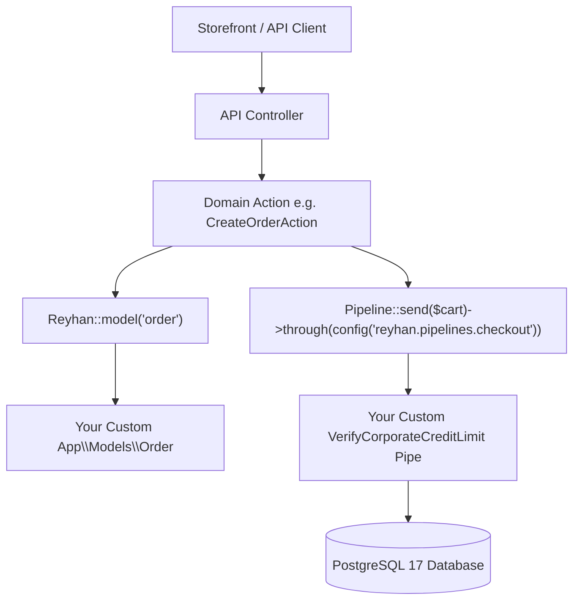

# Customization & Extensibility Overview

- [Introduction](#introduction)
- [The Zero Core Modification Principle](#the-zero-core-modification-principle)
- [Extensibility Points at a Glance](#extensibility-points-at-a-glance)
- [Resolution Architecture](#resolution-architecture)
- [Best Practices for Sovereign Extensions](#best-practices-for-sovereign-extensions)

<a name="introduction"></a>
## Introduction

Reyhan Commerce is engineered from the ground up to be **100% extensible without ever modifying core framework files**. In traditional monolithic e-commerce software, customizing critical business rules—such as altering the checkout flow, swapping out payment gateways, or adding custom columns and relationships to models—often required risky core modifications or fragile monkey-patching that broke upon future upgrades.

In Reyhan, every core domain entity, computational pipeline, notification channel, and administrative component is resolved through dedicated contracts and dynamic registries. When you upgrade Reyhan via `./reyhan update`, all of your sovereign business logic, custom models, and modular plugins remain completely intact and functional.

---

<a name="the-zero-core-modification-principle"></a>
## The Zero Core Modification Principle

The core architectural tenet of Reyhan is:

> **All application-specific logic lives exclusively within your application space (`app/`, `config/`, or `extensions/`). The `vendor/reyhan-commerce/core` package is strictly read-only and immutable.**

By adhering to this principle:
1. **Zero-Breaking Upgrades:** You can update the framework seamlessly using `./reyhan update` with automated database backups and zero downtime.
2. **Clean Separation of Concerns:** Core commerce mechanics (PostgreSQL 17 JSONB matrices, atomic Redis Lua stock locks, ledger accounting) are maintained upstream, while your specialized business rules live in your repository.
3. **Strict Type Safety & Pest Verification:** All customization points adhere to strongly typed PHP 8.4 contracts and can be verified using Pest 4 architecture and feature tests.

---

<a name="extensibility-points-at-a-glance"></a>
## Extensibility Points at a Glance

Reyhan provides dedicated extension vectors for every layer of your commerce stack:

| Customization Vector | Mechanism | Typical Use Cases |
| :--- | :--- | :--- |
| **[Dynamic Model Swapping](/v1/customization/extending-models)** | `config/reyhan.php['models']` & `Reyhan::useModel()` | Adding custom relationships, custom scopes, loyalty point calculators, or national ID attributes to `Order`, `Product`, `User`, etc. |
| **[Business Pipelines](/v1/customization/business-pipelines)** | `Pipeline` pattern & `config/reyhan.php['pipelines']` | Injecting custom fraud checks, ERP inventory verification (Sepidar/Holo), custom tiered B2B pricing, or VIP discounts. |
| **[Payment Gateways](/v1/customization/payment-gateways)** | `PaymentGatewayManager` & `GatewayDriverContract` | Adding Iranian bank gateways (Saman, Mellat, Zarinpal, Sadad), crypto payments, or in-house corporate credit wallets. |
| **[SMS & OTP Drivers](/v1/customization/sms-drivers)** | `SmsManager` & `SmsGatewayContract` | Integrating Kavenegar, FarazSMS, Ghasedak, or specialized corporate SMS aggregators with custom fast-pattern templates. |
| **[Shipping & Carriers](/v1/customization/shipping-methods)** | `ShippingRateCalculatorContract` | Calculating dynamic freight based on volumetric weight, province/city tariffs (Tipax, Post, Chapar), or local courier APIs (SnappBox). |
| **[Filament Admin Panel](/v1/customization/filament-admin)** | `AdminPanelProvider` & Filament v5 Plugins | Adding custom Resources, Pages, interactive Widgets, custom themes, or granular RBAC permission gates (`filament-shield`). |
| **[Modular Extensions](/v1/customization/modular-extensions)** | Drop-in `extensions/` directory & PSR-4 Autoloading | Building isolated, distributable modules with their own routes, migrations, and service providers without editing root files. |
| **[Domain Events & Listeners](/v1/customization/domain-events)** | Laravel Event Dispatcher & Async Queues | Reacting to events like `OrderCreated`, `PaymentVerified`, or `StockDecremented` for real-time CRM and accounting syncs. |

---

<a name="resolution-architecture"></a>
## Resolution Architecture

Reyhan utilizes central contract registries within the service container. When an incoming HTTP request or queue job executes an Action, the framework resolves dependencies through contracts rather than concrete implementations:



---

<a name="best-practices-for-sovereign-extensions"></a>
## Best Practices for Sovereign Extensions

When customizing your Reyhan application, adhere to the following best practices:

### 1. Always Implement Core Contracts
When extending models or services, ensure your class implements the corresponding domain contract (e.g. `Reyhan\Core\Contracts\Models\OrderContract`). This ensures static analysis tools like Larastan and PHPStan (level 9/max) guarantee type consistency.

### 2. Encapsulate Business Logic in Single-Use Actions
Avoid bloating Eloquent models or controller methods with complex mutation logic. Follow the Reyhan Action pattern: create final, strongly typed classes in `app/Actions/` with an `execute()` method.

### 3. Write Pest Feature & Concurrency Tests
Whenever you override a pipeline or model, write automated tests using Pest 4 to verify that the container resolves your custom implementation and that edge cases are guarded against regressions.

```bash
# Run tests after adding customizations
php artisan test --filter=CustomizationTest
```
