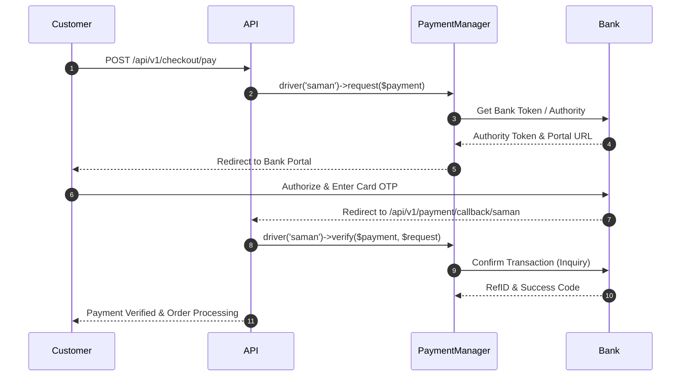

# Custom Payment Gateways

- [Introduction](#introduction)
- [Payment Architecture & Contracts](#payment-architecture)
- [Built-in Payment Drivers](#built-in-drivers)
- [Building a Custom Payment Driver](#building-a-custom-driver)
    - [Step 1: Implementing the Driver Contract](#step-1-driver-contract)
    - [Step 2: Registering with PaymentManager](#step-2-registering-driver)
    - [Step 3: Configuration & Environment Variables](#step-3-configuration)
- [Two-Tier Concurrency & Verification Safeguards](#concurrency-safeguards)
- [Testing Payment Drivers](#testing-drivers)

<a name="introduction"></a>
## Introduction

Reyhan Commerce features an enterprise-grade, driver-based payment architecture. Whether connecting to Iranian banking switches (Saman / SEP, Mellat / Beh Pardakht, Sadad, Zarinpal, PayPing), cryptocurrency gateways, or an in-house customer wallet ledger, every gateway is managed uniformly through the `Payment` facade.

By adhering to the `GatewayDriverContract`, you can integrate any third-party payment provider without changing order creation workflows or checkout controllers.

---

<a name="payment-architecture"></a>
## Payment Architecture & Contracts

The payment lifecycle in Reyhan consists of two strictly guarded phases:

1. **Initiation (`request`):** The driver contacts the bank API, acquires an authority/token, and returns a redirect response to the customer's payment portal.
2. **Verification (`verify`):** When the bank redirects back to `/api/v1/payment/callback/{driver}`, the driver validates the transaction signature, confirms the paid amount, and records reference tracking IDs.



---

<a name="built-in-drivers"></a>
## Built-in Payment Drivers

Reyhan provides pre-configured drivers for standard Iranian payment switches:

| Driver Key | Provider | Mode | Supported Protocols |
| :--- | :--- | :--- | :--- |
| `'zarinpal'` | Zarinpal (زرین‌پال) | REST / JSON | ZarinGate & Normal Web Redirect |
| `'saman'` | Saman Electronic Payment (SEP) | SOAP & REST | Tokenized IPG with Card Pre-Verification |
| `'mellat'` | Beh Pardakht Mellat (به‌پرداخت) | REST & SOAP | Shaparak-compliant Verification & Settle |
| `'sadad'` | Sadad Melli (سداد) | REST | Merchant Token Generation & Verify |
| `'wallet'` | In-House Internal Ledger | Local Atomic | Sub-millisecond Ledger Debit |

---

<a name="building-a-custom-driver"></a>
## Building a Custom Payment Driver

Let's implement a custom driver for **PayPing** as a complete example.

<a name="step-1-driver-contract"></a>
### Step 1: Implementing the Driver Contract

Create `app/Services/Payments/PayPingGatewayDriver.php`:

```php
<?php

declare(strict_types=1);

namespace App\Services\Payments;

use Illuminate\Http\Client\Factory as HttpFactory;
use Illuminate\Http\RedirectResponse;
use Illuminate\Http\Request;
use Reyhan\Core\Contracts\Payments\GatewayDriverContract;
use Reyhan\Core\DTOs\PaymentRedirect;
use Reyhan\Core\DTOs\PaymentVerificationResult;
use Reyhan\Core\Exceptions\PaymentGatewayException;
use Reyhan\Core\Models\Payment;

final class PayPingGatewayDriver implements GatewayDriverContract
{
    public function __construct(
        private readonly HttpFactory $http,
        private readonly string $token,
        private readonly string $callbackUrl,
    ) {}

    /**
     * Request payment authority token from PayPing.
     */
    public function request(Payment $payment): PaymentRedirect
    {
        // Convert Rials to Tomans if required by provider
        $amountToman = (int) ($payment->amount / 10);

        $response = $this->http->withToken($this->token)
            ->post('https://api.payping.ir/v2/pay', [
                'amount' => $amountToman,
                'payerIdentity' => $payment->user?->mobile,
                'payerName' => $payment->user?->full_name,
                'returnUrl' => route('api.v1.payments.callback', ['driver' => 'payping', 'payment' => $payment->id]),
                'clientRefId' => (string) $payment->id,
            ]);

        if (! $response->successful() || empty($response->json('code'))) {
            throw new PaymentGatewayException('Failed to initiate PayPing transaction: '.$response->body());
        }

        $code = (string) $response->json('code');

        // Persist authority token
        $payment->update([
            'gateway_token' => $code,
            'status' => 'pending_gateway',
        ]);

        return new PaymentRedirect(
            url: "https://api.payping.ir/v2/pay/gotoipg/{$code}",
            method: 'GET'
        );
    }

    /**
     * Verify payment status upon bank callback.
     */
    public function verify(Payment $payment, Request $request): PaymentVerificationResult
    {
        $refId = (string) $request->input('refid');
        $amountToman = (int) ($payment->amount / 10);

        $response = $this->http->withToken($this->token)
            ->post('https://api.payping.ir/v2/pay/verify', [
                'refId' => $refId,
                'amount' => $amountToman,
            ]);

        if (! $response->successful()) {
            return new PaymentVerificationResult(
                successful: false,
                errorMessage: 'پرداخت توسط درگاه تأیید نشد یا توسط کاربر لغو گردید.'
            );
        }

        return new PaymentVerificationResult(
            successful: true,
            referenceId: $refId,
            cardNumber: (string) $request->input('cardNumber', ''),
            rawPayload: $response->json() ?? []
        );
    }
}
```

<a name="step-2-registering-driver"></a>
### Step 2: Registering with PaymentManager

Register your custom driver via the `Payment` facade in your `AppServiceProvider.php`:

```php
<?php

declare(strict_types=1);

namespace App\Providers;

use App\Services\Payments\PayPingGatewayDriver;
use Illuminate\Contracts\Foundation\Application;
use Illuminate\Support\ServiceProvider;
use Reyhan\Core\Facades\Payment;

class AppServiceProvider extends ServiceProvider
{
    public function boot(): void
    {
        Payment::extend('payping', function (Application $app) {
            return new PayPingGatewayDriver(
                http: $app->make('http'),
                token: (string) config('payment.drivers.payping.token'),
                callbackUrl: (string) config('payment.drivers.payping.callback_url')
            );
        });
    }
}
```

<a name="step-3-configuration"></a>
### Step 3: Configuration & Environment Variables

Add the driver configuration in `config/payment.php`:

```php
// config/payment.php

return [
    'default' => env('PAYMENT_DEFAULT_DRIVER', 'zarinpal'),

    'drivers' => [
        'payping' => [
            'token' => env('PAYPING_API_TOKEN'),
            'callback_url' => env('PAYPING_CALLBACK_URL'),
        ],
        // Other drivers...
    ],
];
```

Update your `.env` file:

```env
PAYMENT_DEFAULT_DRIVER=payping
PAYPING_API_TOKEN=your-sandbox-or-live-token-here
```

---

<a name="concurrency-safeguards"></a>
## Two-Tier Concurrency & Verification Safeguards

To prevent race conditions, duplicate webhook calls, or double balance credits, Reyhan automatically wraps driver verification inside a pessimistic database lock:

```php
// Handled automatically by Reyhan's VerifyPaymentAction:
DB::transaction(function () use ($payment, $request, $driver) {
    /** @var Payment $lockedPayment */
    $lockedPayment = Payment::query()
        ->lockForUpdate()
        ->findOrFail($payment->id);

    if ($lockedPayment->status === 'paid') {
        // Prevent duplicate processing
        return $lockedPayment;
    }

    $result = $driver->verify($lockedPayment, $request);

    if ($result->successful) {
        $lockedPayment->markAsPaid($result->referenceId, $result->cardNumber);
        $lockedPayment->order->markAsProcessing();
    } else {
        $lockedPayment->markAsFailed($result->errorMessage);
    }
});
```

---

<a name="testing-drivers"></a>
## Testing Payment Drivers

You can easily mock bank API responses using Laravel's `Http::fake()` and Pest 4:

```php
<?php

declare(strict_types=1);

use App\Models\User;
use Illuminate\Support\Facades\Http;
use Reyhan\Core\Facades\Payment;
use Reyhan\Core\Models\Payment as PaymentModel;

it('successfully initiates payping payment and returns redirect url', function () {
    Http::fake([
        'https://api.payping.ir/v2/pay' => Http::response(['code' => 'ABC-12345'], 200),
    ]);

    $payment = PaymentModel::factory()->create([
        'amount' => 500_000, // 50,000 Tomans
    ]);

    $redirect = Payment::driver('payping')->request($payment);

    expect($redirect->url)
        ->toBe('https://api.payping.ir/v2/pay/gotoipg/ABC-12345');
        
    expect($payment->fresh()->gateway_token)->toBe('ABC-12345');
});
```
