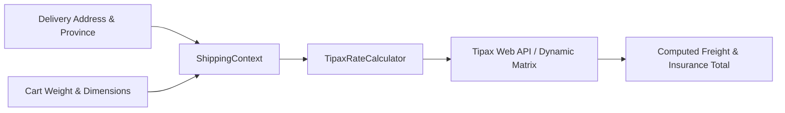

# Shipping Methods & Carriers

- [Introduction](#introduction)
- [How Shipping Rates Are Calculated](#rate-calculation-architecture)
- [Built-in Carriers & Calculators](#builtin-carriers)
- [Building a Custom Shipping Rate Calculator](#custom-calculator)
    - [Step 1: Implementing ShippingRateCalculatorContract](#step-1-contract)
    - [Step 2: Registering the Calculator](#step-2-registering)
- [Volumetric Weight & Provincial Tariffs](#volumetric-weight)
- [Testing Shipping Calculations](#testing-shipping)

<a name="introduction"></a>
## Introduction

Calculating accurate shipping tariffs is crucial for e-commerce operations. Shipping costs in Iran vary significantly based on the parcel's weight, dimensions (volumetric weight), destination province/city, insurance value, and the selected carrier (Iran Post Pishtaz, Tipax, Chapar, SnappBox, or local courier).

Reyhan Commerce provides an extensible, contract-based shipping calculation system. You can define custom rate calculators, integrate third-party courier APIs, or implement rule-based flat tariffs.

---

<a name="rate-calculation-architecture"></a>
## How Shipping Rates Are Calculated

When a customer specifies their delivery address during checkout, the `CalculateShippingRateAction` executes the calculator bound to the requested shipping method:



---

<a name="builtin-carriers"></a>
## Built-in Carriers & Calculators

| Carrier / Calculator | Calculation Strategy |
| :--- | :--- |
| **Iran Post (پیشتاز / سفارشی)** | Weight tier + Provincial distance matrix (همجوار / غیرهمجوار) |
| **Tipax (تیپاکس)** | Volumetric weight + Express zone pricing |
| **Free Delivery Threshold (ارسال رایگان)** | Triggers when cart total exceeds a configurable threshold (e.g., > 2,000,000 Tomans) |
| **Local Urban Courier (پیک موتوری شهری)** | Flat rate or distance-based radius calculation for intra-city orders |

---

<a name="custom-calculator"></a>
## Building a Custom Shipping Rate Calculator

Let's build a custom shipping calculator for **Chapar Express** (چاپار) with dynamic dimensional weight computation.

<a name="step-1-contract"></a>
### Step 1: Implementing ShippingRateCalculatorContract

Create `app/Services/Shipping/ChaparRateCalculator.php`:

```php
<?php

declare(strict_types=1);

namespace App\Services\Shipping;

use Reyhan\Core\Contracts\Shipping\ShippingRateCalculatorContract;
use Reyhan\Core\DTOs\ShippingCalculationContext;
use Reyhan\Core\DTOs\ShippingRateResult;

final class ChaparRateCalculator implements ShippingRateCalculatorContract
{
    private const int BASE_FARE = 650_000; // 65,000 Tomans base fee
    private const int PER_KG_FARE = 120_000; // 12,000 Tomans per additional kg

    public function calculate(ShippingCalculationContext $context): ShippingRateResult
    {
        // 1. Calculate physical weight in Kilograms
        $physicalWeightKg = max(1.0, $context->totalWeightGrams / 1000);

        // 2. Calculate volumetric dimensional weight (L x W x H / 5000)
        $volumetricWeightKg = ($context->lengthCm * $context->widthCm * $context->heightCm) / 5000;

        // 3. Billable weight is the maximum of physical vs volumetric
        $billableWeightKg = ceil(max($physicalWeightKg, $volumetricWeightKg));

        $totalFreight = self::BASE_FARE;

        if ($billableWeightKg > 1) {
            $totalFreight += (int) (($billableWeightKg - 1) * self::PER_KG_FARE);
        }

        // Additional 10% insurance fee for high-value carts
        if ($context->cartDeclaredValue > 10_000_000) {
            $totalFreight += (int) ($context->cartDeclaredValue * 0.002);
        }

        return new ShippingRateResult(
            carrier: 'chapar',
            cost: $totalFreight,
            estimatedDeliveryDays: 2,
            isAvailable: true
        );
    }
}
```

<a name="step-2-registering"></a>
### Step 2: Registering the Calculator

Register your custom calculator in `app/Providers/AppServiceProvider.php`:

```php
<?php

declare(strict_types=1);

namespace App\Providers;

use App\Services\Shipping\ChaparRateCalculator;
use Illuminate\Support\ServiceProvider;
use Reyhan\Core\Facades\Shipping;

class AppServiceProvider extends ServiceProvider
{
    public function boot(): void
    {
        Shipping::registerCalculator('chapar', new ChaparRateCalculator());
    }
}
```

---

<a name="volumetric-weight"></a>
## Volumetric Weight & Provincial Tariffs

> [!TIP]  
> **Iranian Postal Zones:** Reyhan's `provinces` and `cities` tables include geographical zone identifiers (`province_type = 'neighboring' | 'remote'`). You can access `$context->destinationAddress->province->isNeighboringTo(config('reyhan.warehouse_province_id'))` to apply neighboring province discounts.

---

<a name="testing-shipping"></a>
## Testing Shipping Calculations

```php
<?php

declare(strict_types=1);

use App\Services\Shipping\ChaparRateCalculator;
use Reyhan\Core\DTOs\ShippingCalculationContext;

it('correctly calculates volumetric billable weight for bulky parcels', function () {
    $calculator = new ChaparRateCalculator();

    // Box: 50cm x 40cm x 30cm => 60,000 / 5000 = 12 Kg (even if actual weight is only 2 Kg)
    $context = new ShippingCalculationContext(
        totalWeightGrams: 2000,
        lengthCm: 50,
        widthCm: 40,
        heightCm: 30,
        cartDeclaredValue: 5_000_000
    );

    $result = $calculator->calculate($context);

    // 12 Kg => Base (1kg: 650,000) + 11 * 120,000 = 1,970,000 Rials
    expect($result->cost)->toBe(1_970_000);
});
```
