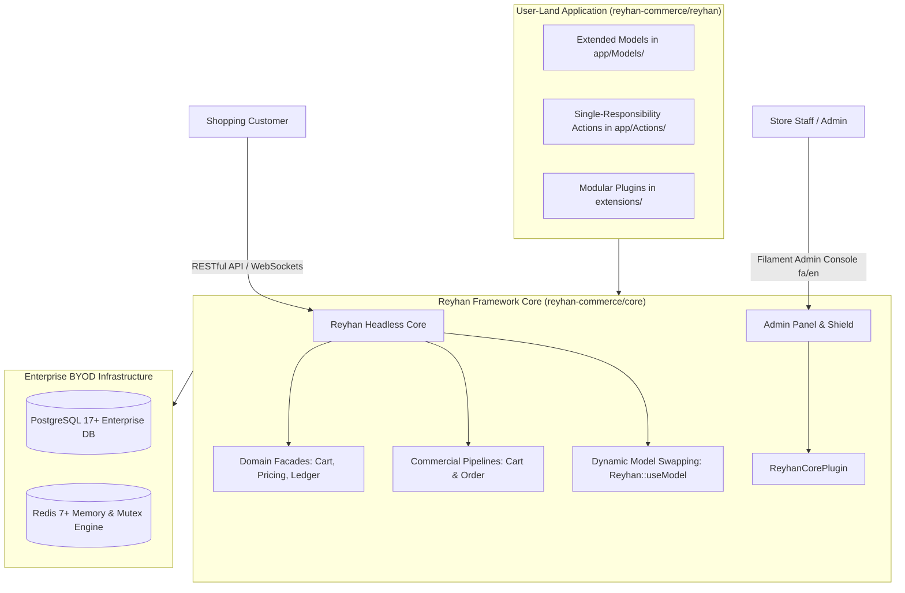

# Overview & Architecture

- [Introduction](#introduction)
- [Core Architectural Principles](#core-principles)
    - [Single-Use Actions & Strongly-Typed DTOs](#actions-and-dtos)
    - [Zero Core Modification (Upgrade Safety)](#zero-core-modification)
    - [Bring Your Own Database (BYOD)](#byod-infrastructure)
    - [Unified Central Orchestrator CLI](#unified-cli)
- [Ecosystem Architecture](#ecosystem-architecture)
- [Technology Stack Matrix](#technology-stack)
- [Next Steps](#next-steps)

## Introduction

**Reyhan Commerce** is a sovereign, enterprise-scale, headless e-commerce framework designed to power high-performance, maintainable, and infinitely extensible online stores on **Laravel 13** and **PHP 8.4+**.

Unlike monolithic shopping carts or rigid starter kits, Reyhan enforces an unyielding **Core vs. User-Land Boundary**. This architectural foundation guarantees that you can customize every aspect of your store—Eloquent models, business rules, checkout pipelines, payment gateways, and administrative consoles—without ever altering core framework files.

---

## Core Architectural Principles

### Single-Use Actions & Strongly-Typed DTOs

In Reyhan, business operations are never scattered across fat controllers or tangled model callbacks. Every single commercial operation (such as placing orders, allocating stock, validating promotional coupons, or verifying bank payments) is encapsulated within a dedicated `final` **Action** class with a strict `execute()` method and strongly-typed **Data Transfer Objects (DTOs)**.

> [!NOTE]  
> Heavy repository abstractions are strictly prohibited in Reyhan in favor of native, high-performance Eloquent queries, query scopes, and builder methods.

### Zero Core Modification (Upgrade Safety)

The core domain engine is distributed as an immutable Composer library (`reyhan-commerce/core`). You never modify vendor files. All store customizations are performed via:

* **[Dynamic Model Swapping](/v1/customization/extending-models):** Subclassing base models and registering them via `Reyhan::useModel()` or `config/reyhan.php`.
* **[Hookable Pipelines](/v1/customization/business-pipelines):** Injecting custom validation and calculation pipes into checkout and pricing workflows.
* **[Modular Extensions](/v1/customization/modular-extensions):** Dropping self-contained PSR-4 modules into the `extensions/` directory.

### Bring Your Own Database (BYOD)

Reyhan is engineered for modern cloud infrastructure:
* **PostgreSQL 17+:** Leverages native `JSONB` for product variant attribute matrices, `GIN` indices for sub-millisecond filtering, and `pg_trgm` fuzzy text search.
* **Redis 7+:** Powers real-time shopping cart caching, distributed sessions, and atomic Lua script stock reservation mutexes.

### Unified Central Orchestrator CLI

Reyhan includes a root binary (`./reyhan`) and a global scaffolding CLI (`reyhan new`) that automate store creation, dependency health diagnostics (`doctor`), database migrations, zero-downtime updates, and local server synchronization.

---

## Ecosystem Architecture

The Reyhan ecosystem consists of four decoupled components:

| Repository / Package | Purpose & Role |
| :--- | :--- |
| **`reyhan-commerce/core`** | The headless domain engine containing actions, DTOs, contracts, facades, and migrations. |
| **`reyhan-commerce/reyhan`** | The clean application starter skeleton containing your app's models, routes, configs, and tests. |
| **`reyhan-commerce/installer`** | The global Composer CLI scaffolder (`reyhan new`) featuring interactive terminal prompts. |
| **`reyhan-commerce/storefront-nuxt`** | The decoupled official Nuxt 4 storefront with Tailwind 4 and Pinia. |

---

## Technology Stack Matrix

| Domain | Technology | Architectural Role |
| :--- | :--- | :--- |
| **Backend Engine** | **PHP 8.4+ & Laravel 13** | Single-responsibility Actions, typed DTOs, native Eloquent persistence, and queue workers. |
| **Admin Backoffice** | **Filament v5 & Livewire 3** | High-productivity Persian/English admin console with granular RBAC permissions. |
| **Primary Database** | **PostgreSQL 17+** | JSONB variant matrices, GIN indices, and pessimistic database row-locking (`lockForUpdate`). |
| **Cache & Mutex** | **Redis 7+** | Sub-millisecond cart caching, distributed sessions, and self-purging ZSET stock reservation mutexes. |
| **High-Performance Runtime** | **FrankenPHP Octane & Caddy** | Worker-mode execution for ultra-low latency and automated TLS certificate handling. |
| **Testing Suite** | **Pest 4** | End-to-end domain feature testing, concurrency assertions, and automated API testing. |

---

## Next Steps

Now that you understand the architectural philosophy of Reyhan Commerce, you are ready to scaffold your store:

* [Installation Guide](/v1/getting-started/installation)
* [Configuration & Environment](/v1/getting-started/configuration)
* [Directory Structure](/v1/getting-started/directory-structure)
