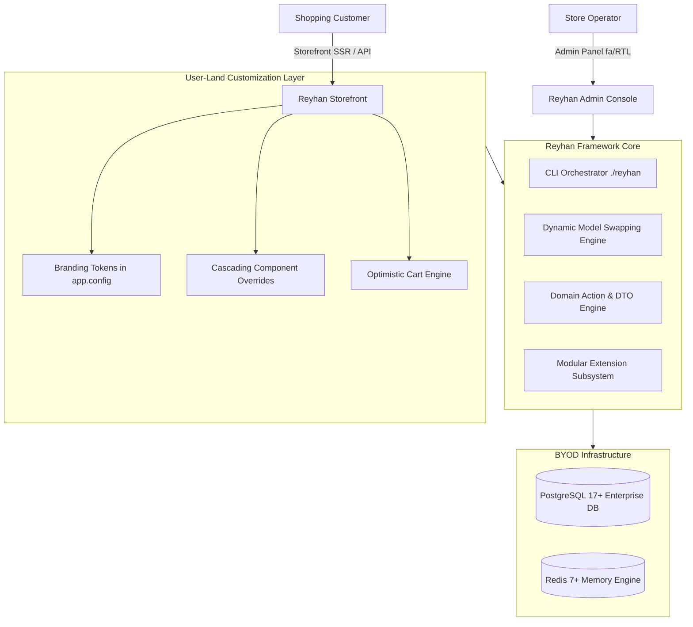

# Overview & Architecture Philosophy

**Reyhan Commerce** is an enterprise-grade, full-stack, headless e-commerce framework designed to build high-performance, maintainable, and infinitely extensible online stores.

Unlike traditional monolithic shopping carts or generic starters, Reyhan enforces a strict **Core vs. User-Land Boundary**. This architectural principle guarantees that developers can customize every aspect of their store—models, business logic, visual components, and administrative workflows—without altering core framework files, enabling seamless central updates via a single CLI command.

---

## Core Pillars of Reyhan

### 1. The Action & DTO Domain Standard
Business operations in Reyhan are never scattered across fat controllers or tangled model callbacks. Every single commercial operation (e.g., checkout order creation, voucher validation, inventory allocation) is encapsulated in a dedicated `final` **Action** class with a strict `execute()` method and strongly-typed **Data Transfer Objects (DTOs)**. Heavy, unidiomatic Repository patterns are strictly prohibited in favor of native, high-performance Eloquent features.

### 2. Zero Core Modification (Upgrade Safety)
In Reyhan, the core codebase is treated as an immutable dependency. You never edit vendor files. Customizations are achieved via:
- **Backend:** Dynamic Model Swapping (`App\Support\Reyhan::model()`) and the modular `backend/extensions/` directory.
- **Frontend:** Cascading component and layout overriding within `frontend/app/` combined with token-driven branding in `app.config.ts`.

### 3. Bring Your Own Database (BYOD)
Reyhan does not bundle or force a database server installation. Instead, it relies on enterprise infrastructure: **PostgreSQL 17+** (leveraging native `JSONB`, `GIN` indices, and `pg_trgm` fuzzy text matching) and **Redis 7+** (for sub-millisecond cart caching, distributed sessions, and worker queues). Connections are managed cleanly via environment variables.

### 4. Central Orchestrator CLI (`./reyhan`)
The framework ships with an executable orchestrator in the project root that automates development workflows, dependency health diagnostics (`doctor`), database migrations, zero-downtime updates, and local server synchronization.

---

## 🛠️ Technology Stack & Architectural Foundation

| Domain | Technology / Engine | Architectural Role & Implementation Details |
| :--- | :--- | :--- |
| **Backend Engine** | **PHP 8.4+ & Laravel 13** | Single-responsibility `final` Action classes, strongly-typed DTOs (`spatie/laravel-data`), native Eloquent entities, and queue workers. |
| **Admin Backoffice** | **Filament 5 & Livewire 3** | High-productivity Persian/English admin console, RBAC permissions (`filament-shield`), and websocket real-time updates. |
| **Storefront Layer** | **Nuxt 4 & Vue 3** | Server-Side Rendering (SSR), Composition API, Pinia state stores, Reka UI headless primitives, and Tailwind 4. |
| **Primary Database** | **PostgreSQL 17+** | Enterprise JSONB variant matrices, GIN indexing, `pg_trgm` fuzzy text matching, and pessimistic database row-locking (`lockForUpdate`). |
| **Memory & Mutex Engine** | **Redis 7+** | Sub-millisecond cart caching, distributed sessions, Horizon queues, and self-purging ZSET stock reservation mutexes. |
| **High-Performance Runtime** | **FrankenPHP Octane & Caddy** | Worker-mode execution for microsecond response times and automated SSL certificate management. |
| **Testing & Quality Assurance** | **Pest 4 & Vitest** | End-to-end domain feature testing, concurrency assertions, and automated UI unit testing. |

---

## Architectural Feature Matrix

| Domain | Architectural Implementation | Key Benefit |
| :--- | :--- | :--- |
| **Authentication** | Complete isolation: OTP SMS for customers, Session/Shield for Staff | Enhanced security, zero-friction customer onboarding |
| **Inventory Concurrency** | Atomic database transactions with pessimistic & Redis locking | Elimination of overselling during high-traffic flash sales |
| **Payment Subsystem** | Driver-based unified payment gateway manager | Seamless switching between banking gateways |
| **Notification Engine** | Multi-driver transactional SMS engine with pattern templates | Reliable, instant OTP and order status alerts |
| **Text Normalization** | Automated pipeline for character and digit standardization | Clean search indexing and consistent Persian/Arabic data |
| **Storefront UX** | Semantic token architecture, zero custom CSS, WCAG 2.1 AA | Blazing fast load times, accessible on all devices |

---

## Next Steps

To install your first Reyhan Commerce store, proceed to the [Installation Guide](/v1/getting-started/installation).
