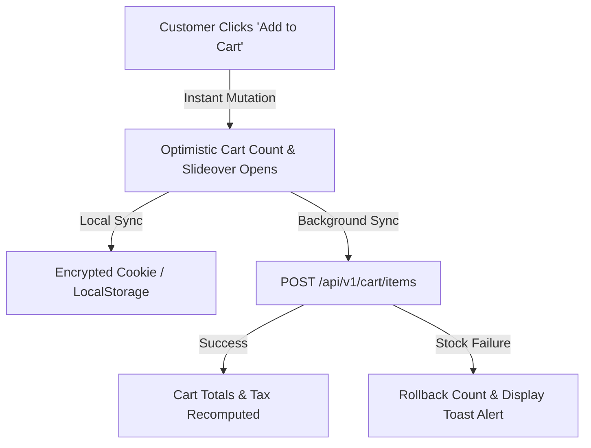

# Cart State Store (`useCartStore`)

The shopping bag in Reyhan is driven by a reactive **Pinia Store** that delivers instant visual feedback, optimistic updates, offline resilience, and automatic synchronization with backend inventory.

---

## 1. Store Lifecycle & Reactive Flow



---

## 2. Using `useCartStore` in Components

```vue
<script setup lang="ts">
import { useCartStore } from '~/stores/cart'

const cartStore = useCartStore()
const toast = useToast()

const handleAddToCart = async (variantId: number) => {
  try {
    await cartStore.addItem({
      variantId,
      quantity: 1,
    })
    toast.add({
      title: 'Added to Bag',
      description: 'Your item is safely reserved in your cart.',
      color: 'primary',
    })
  } catch (error) {
    toast.add({
      title: 'Out of Stock',
      description: 'This variant is currently unavailable.',
      color: 'error',
    })
  }
}
</script>

<template>
  <UButton
    icon="i-lucide-shopping-bag"
    :loading="cartStore.isLoading"
    @click="handleAddToCart(product.defaultVariantId)"
  >
    Add to Bag
  </UButton>
</template>
```

---

## 3. Free Shipping Calculation Helper

The cart store provides real-time progress calculations for threshold promotions (e.g., free shipping):

```ts
// Computed in useCartStore
const freeShippingThreshold = 500000 // In Currency Units
const progressPercentage = computed(() => {
  return Math.min(100, (cartStore.subtotal / freeShippingThreshold) * 100)
})
```
